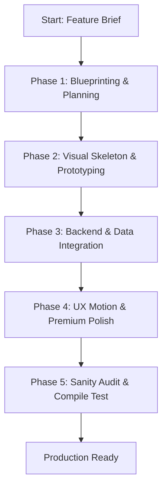

# 🗺️ Next.js Monolith Unified Playbook: End-to-End Execution Workflow

This playbook synthesizes all core rules, boundaries, and motion standards from `.ai-instructions.md`, `.ai-agents/`, `CONTEXT.md`, `DESIGN.md`, and `AGENTS.md` into a single, step-by-step master execution plan. 

Follow this blueprint to implement any new feature, page, database schema, or UI refactoring with 100% architectural alignment.

---



---

## 🧭 PHASE 1: PLANNING & ARCHITECTURAL BLUEPRINT
**🤖 Orchestrated by:** `Planner Agent` *(Gemini 3.1 Pro)*  
**📖 Primary Sources:** `.ai-instructions.md` (Sec. 1, 2), `CONTEXT.md` (Sec. 1, 3), `.ai-agents/app-architecture.md` (Sec. 1, 2)

Before writing a single line of production code, compile a comprehensive architectural blueprint:
1. **Determine Routing Scope:**
   * **One-Pager:** Append sequential sections to `src/app/(public)/page.tsx` using semantic section tags and HTML `id`s for anchor navigation.
   * **Multi-Pager:** Create a dedicated sub-folder with a Server Component entry `src/app/(public)/[feature]/page.tsx`.
2. **Define Server/Client Boundaries:**
   * Default all pages to **Server Components** (`page.tsx`).
   * Identify required interactive elements (forms, clicks, state toggles). Mark these as **Client Components** at the lowest leaf-node level (e.g., `src/components/public/[Feature]Form.tsx`) and import them into the parent Server Component.
3. **Map the Data Abstraction Layer:**
   * Define the interface signature inside the Repository Layer (`src/lib/repositories/[feature].ts`).
   * Ensure the UI component only calls repository async methods and remains completely decoupled from direct ORM clients.

---

## 🎨 PHASE 2: VISUAL PROTOTYPING & MOCK FIXTURES
**🤖 Orchestrated by:** `Implementation Agent` *(Gemini 3.1 Pro)*  
**📖 Primary Sources:** `.ai-agents/design-to-code.md`, `DESIGN.md` (Accessibility Spec), `.ai-instructions.md` (Sec. 4)

Implement the user interface skin entirely decoupled from live databases:
1. **FIGMA Auto-Layout to CSS:**
   * Translate Auto-Layout configurations into fluid Tailwind v4 `flex` or `grid` containers.
   * **Never hardcode pixel sizes** (avoid `w-[800px]`, `h-[400px]`). Use responsive text limits (`max-w-4xl`), grid constraints, or aspect ratios (`aspect-video`).
2. **Apply Theme Taxonomy:**
   * Check user brief configuration mappings:
     * **Shape:** `rounded-none` (Sharp), `rounded-xl` (Light Round), `rounded-full` (Pill).
     * **Typography:** `font-serif` (Display) vs `font-sans` (Narrative).
     * **Canvas Shading:** Soft matte off-white (`#f5f5f7`, `bg-neutral-50`) + high-contrast text (`text-black`) + drop shadow (`shadow-sm`) + border outline (`border-neutral-300`).
3. **Generate Visual Fixtures:**
   * Create mock datasets inside `src/lib/repositories/fixtures.ts` mirroring the planned schema.
   * Feed components with these fixtures so they compile and display beautifully instantly.

---

## ⚡ PHASE 3: BACKEND, REPOSITORIES & DATABASE MUTATION
**🤖 Orchestrated by:** `Implementation / Security Agent` *(Gemini 3 / Antigravity)*  
**📖 Primary Sources:** `.ai-agents/backend-rules.md`, `.ai-instructions.md` (Sec. 6, 7, 8, 9)

Replace the static mock fixtures with resilient, type-safe database mutations and API endpoints:
1. **Write Relational Database Schema (If `ACTIVE_MODE = "LOCAL_PRISMA"`):**
   * Edit `prisma/schema.prisma` using `cuid()` for primary keys.
   * Enforce **Image Architecture:** Never save image URL strings directly to parent models. Use a related image table (e.g. `CollectionItemImage`) supporting `url`, `alt`, `sortOrder`, and `isCover: Boolean`.
   * Enforce **Cascade Integrity:** Add `onDelete: Cascade` on all related foreign keys to ensure database hygiene.
2. **Implement the Repository Switch Layer:**
   * Write the database fetching and transaction logic inside `src/lib/repositories/[feature].ts`.
   * **Dynamic Switch Rule:** The repository must dynamically inspect `process.env.ACTIVE_MODE`:
     * **LOCAL_PRISMA:** Mutate and query using the singleton Prisma Client.
     * **HEADLESS_CMS / Vercel KV:** Read and write structured JSON arrays/objects from/to Vercel KV REST endpoints.
3. **Defensive API Gateways & Zod Defense:**
   * Route Handlers (`src/app/api/admin/[feature]/route.ts`) must rigorously parse and clean incoming request bodies using Zod schemas (`safeParse()`) before passing them to the database.
   * Preprocess numeric fields (like prices or sort order indices) to prevent runtime NaN exceptions.
4. **Local Hashed Media upload (`/api/admin/upload`):**
   * Validate MIME types (JPEG, PNG, WEBP).
   * Programmatically construct recursive physical folders (`public/uploads/` via `fs.mkdir`).
   * Discard original filenames. Hash using `crypto.randomUUID()` joined with the original extension. Limit the sluggified name to a maximum of 90 characters.

---

## ✨ PHASE 4: VISUAL REFINE & EMIL KOWALSKI MOTION POLISH
**🤖 Orchestrated by:** `UX / Refactor Agent` *(ChatGPT Pro Codex)*  
**📖 Primary Sources:** `DESIGN.md`, `.ai-agents/design-to-code.md` (Sec. 6: Scroll Protocol)

Inject tactile feel, micro-animations, and hardware-accelerated curves:
1. **The transition-all Ban:**
   * Audit all components. Replace generic `transition-all` with explicit CSS targets (`transition-[transform,opacity,background-color]`).
   * Limit transition durations to snappy curves under 300ms (100-160ms for button clicks).
2. **Haptic Click Feedback:**
   * Inject `active:scale-[0.97]` or `active:scale-[0.99]` on all clickable containers to give instant physical press feedback.
   * Apply hardware acceleration properties (`will-change: transform, opacity`) on animated elements.
3. **Scroll-Driven Entrance Protocol:**
   * For viewport reveals, bind a native, lightweight `IntersectionObserver` that toggles `data-in-view="true"`.
   * Set reveals to fire `{ once: true }` by default to avoid repetitive distractions.
   * Enforce **Micro-Staggering Constraints:** Apply grid and list items stagger delays with incremental steps strictly between `30ms` and `60ms`.

---

## 🔒 PHASE 5: SECURITY AUDIT & COMPILE SANITY
**🤖 Orchestrated by:** `Security Agent / Human Gatekeeper`  
**📖 Primary Sources:** `.ai-instructions.md` (Sec. 7), `CONTEXT.md` (Sec. 3 - Phase 4)

Lock down admin perimeters and perform absolute type-safety checks:
1. **Double-Gated Middleware Boundaries:**
   * Admin Pages (`/admin/:path*`): Ensure Middleware triggers a redirect to `/login` if unauthorized.
   * Admin API (`/api/admin/:path*`): Verify Middleware aborts instantly with a clean `401 Unauthorized` JSON payload to protect frontend fetch loops.
2. **Run Strict Type Check:**
   * Ensure TypeScript passes perfectly:
     ```powershell
     npx tsc --noEmit
     ```
3. **Execute Production Build:**
   * Compile the Next.js bundle to confirm static asset optimization, server component serialization, and zero compilation warnings:
     ```powershell
     npx next build
     ```
